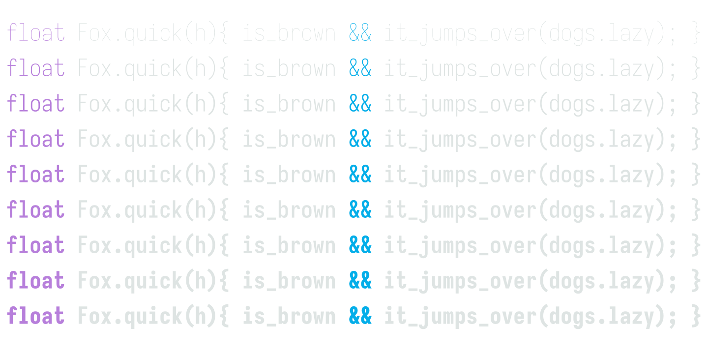

# Fonts I like

## Access from anywhere using JSDelivr

For example, the CSS below produces the expected result:

```css

@import url(https://cdn.jsdelivr.net/gh/arnos-stuff/fonts@latest/Mona-Sans.woff2);

```

## Fira Code

I got the Fira Code font from the [Nerd Fonts project](https://github.com/ryanoasis/nerd-fonts/).

But the font is also available on the [Fira Code project page](https://github.com/tonsky/FiraCode).

Preview of the font:


## Iosevka

I got Iosevka from the creator's [GitHub page](https://github.com/be5invis/Iosevka).

Preview of the font:



## Playfair Display

I got Playfair Display from [Google Fonts](https://fonts.google.com/specimen/Playfair+Display).
